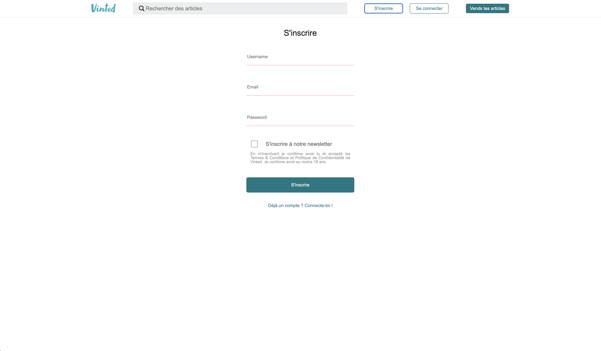

# ✨ Réplique de Vinted — Projet Front-End en React ✨

> Une réplique du site Vinted, conçue pour apprendre React et son utilisation dans un projet web marchand.

  
_Page d'accueil avec recherche, inscription et vignettes d'articles._

  
_Formulaire d'inscription avec validation d'une newsletter._

Projet déployé sur [Netlify](https://www.netlify.com/) et consultable à l'adresse : https://inquisitive-sunburst-f76586.netlify.app/

## 📌 Description

Ce projet est une réplique fonctionnelle du site Vinted, réalisé pendant ma formation de développeur web/mobile. Il met en pratique les concepts clés de React pour construire une interface dynamique et interactive, avec gestion des routes, authentification et intégration d’un système de paiement.

L’objectif était d’apprendre à :

- Structurer une application React moderne.
- Gérer la navigation avec React Router.
- Implémenter une authentification simple via JS Cookie.
- Intégrer Stripe pour simuler des paiements en ligne.

## 🏗️ Technologies utilisées

- **React** — Framework principal
- **React Router** — Gestion des routes
- **JS Cookie** — Gestion de l’authentification (session), via le stockage du token de l'utilisateur dans un cookie
- **Stripe** — Simulation de paiement (mode test)
- **CSS** — Style du site

## 🛠️ Développement

- **React Hooks** - pour la gestion d'état locale (`useState` et `useEffect`)
- `useEffect` - pour le chargement des données
- `useNavigate` - pour la redirection automatique

## 🚀 Installation

### Prérequis

- npm ou yarn

### Étapes

1. Cloner le dépôt :

```bash
git clone https://github.com/JulienBCHZ/exo-vinted-frontend
```

2. Installer les dépendances :

```bash
npm install
# ou
yarn install
```

3. Lancer le projet en mode développement :

```bash
npm run dev
# ou
yarn dev
```

Un serveur de développement se lancera et l’application sera accessible à l’adresse : http://localhost:5173.

## 📄 License

Ce projet est fourni à des fins éducatives. Il n’est pas destiné à un usage commercial.

## 📡 Contact

Julien Bouchez : julienbouchez@icloud.com
Profile GitHub : [@JulienBCHZ](https://github.com/JulienBCHZ)
